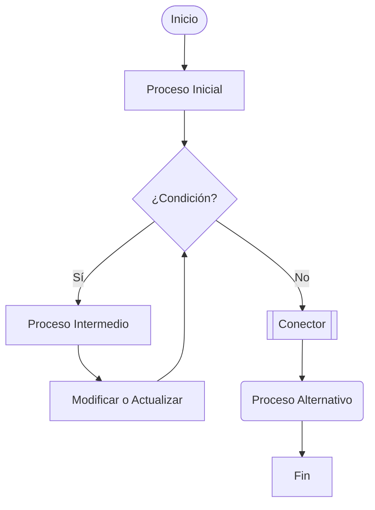

### Paso 1: Preparación del Entorno

Asegúrate de tener acceso a un entorno que pueda renderizar código Mermaid. Esto puede ser un editor de texto con soporte de Mermaid, una herramienta en línea como Mermaid Live Editor, o una página de Markdown que lo soporte.

### Paso 2: Definición de Símbolos en Mermaid

Aquí hay un conjunto más completo de símbolos de diagrama de flujo que se pueden usar en Mermaid:

1. **Inicio/Fin (Start/End)**: Se representa comúnmente por un óvalo o un círculo.
2. **Proceso (Process)**: Usualmente representado por un rectángulo.
3. **Decisión (Decision)**: Representado por un rombo.
4. **Entrada/Salida (Input/Output)**: Representado por un paralelogramo.
5. **Subproceso (Subroutine)**: A menudo ilustrado con un rectángulo con líneas dobles a cada lado.
6. **Documento (Document)**: Un rectángulo con una onda en su parte inferior.
7. **Entrada Manual (Manual Input)**: Un rectángulo inclinado.
8. **Archivo de Datos (Data Storage)**: Un cilindro.
9. **Conector Fuera de Página (Off-page Connector)**: Se puede representar con un escudo.
10. **Conector (Connector)**: Normalmente representado por un pequeño círculo.
11. **Preparación (Preparation)**: Generalmente se ilustra con un hexágono.

### Paso 3: Ejemplo de Diagrama de Flujo Completo

Ahora, vamos a ponerlo todo junto en un diagrama de flujo más complejo:

### Explicación del Ejemplo:

1. **A ([Inicio])**: Indica el inicio del proceso.
2. **B [Prepara Datos]**: Un paso de proceso regular donde se preparan los datos.
3. **C {¿Validez de Datos?}**: Un punto de decisión sobre la validez de los datos.
   - **Sí**: Cuando los datos son válidos, pasa al procesamiento.
   - **No**: Solicita una entrada manual para corregir datos.
4. **E [Manual Input]**: Alerta del ingreso manual de datos incorrectos.
5. **D [Procesar Datos]**: Donde se realiza el procesamiento de datos apropiados.
6. **F [(Almacenar Datos)]**: Simboliza el almacenamiento de datos en un sistema.
7. **G [/Salida de Datos/]**: Lugar donde se introducen los datos salientes.
8. **H [Generar Documento]**: Generación de un documento a partir de los datos procesados.
9. **I {{Conector}}**: Utilizado para conectar diferentes partes del diagrama que pueden no estar directamente unidas.
10. **J [\Mostrar al Usuario/]**: La salida es revisada por el usuario.
11. **K ([Fin])**: Indica el final del proceso.
12. **L [Generar Informe]**: Un sub-proceso opcional para creación de informes.
13. **M {¿Más Procesos?}**: Decide si el flujo debe continuar con procesamiento adicional.

### Paso 4: Renderizar y Comprobar

Introduce el código anterior en tu herramienta de preferencia para visualizar el diagrama de flujo completo. Esta representación incluye todos los símbolos comúnmente utilizados y te permite ver cómo modelar un flujo de proceso complejo.

Este instructivo proporciona una comprensión de cómo representar diferentes acciones y decisiones dentro de un diagrama de flujo en Mermaid utilizando una variedad de símbolos formales.

En los diagramas de flujo, los conectores son importantes para mantener el diagrama limpio y organizado. Especialmente en diagramas grandes, facilitan la conexión entre partes del diagrama sin que las líneas se crucen entre sí, utilizando flechas para conectar un punto a otro del diagrama.

### Uso de Conectores en Mermaid

En Mermaid, no hay un símbolo explícito solo para conectores, pero se puede representar la esencia de un conector mediante nodos etiquetados y flechas. Los conectores fuera de página y los loops (como un `while`) se harían mediante flujo de conexión.

#### Ejemplo que Incluye Conectores

Usaremos etiquetas en nodos como nuestra forma de "nombre" de conector entre diferentes secciones.

### Explicación Detallada del Ejemplo

1. **A ([Inicio])**: Marca el inicio del diagrama de flujo.
2. **B [Proceso Inicial]**: Un paso inicial en el flujo.
3. **C {¿Condición?}**: Un nodo de decisión que evalúa una declaración booleana.
   - **Sí**: Si la condición es verdadera, continua al proceso de bucle `D`.
   - **No**: Se mueve al `F [[Conector]]`.
4. **D [Proceso Intermedio]**: Realiza ciertas acciones si la condición es verdadera.
5. **E [Modificar o Actualizar]**: Cambiar variables involucradas y controlar el flujo del bucle, después de lo cual se vuelve a evaluar la condición (`C`).
6. **F [[Conector]]**: Este nodo actúa como enlace o referencia hacia la siguiente parte del diagrama. Aunque en Mermaid no hay un símbolo dedicado para un conector fuera de página, los nodos etiquetados dan la noción de conexión.
7. **G (Proceso Alternativo)**: Indica un camino alternativo después de concluir con el bucle.
8. **H [Fin]**: Marca la terminación del diagrama de flujo.

### Consideración de Conectores:

- **Conectores y claridad**: Facilitan vínculos entre nodos distantes y evitan el cruce de líneas.
- **Prácticas comunes**: Es común utilizar nodos con etiquetas como "Conector" junto con flechas de retorno y líneas continuas para conectar fácilmente con lugares lejanos o simplemente para destacar en documentos extensivos.

Si necesitas todavía más ajuste o detalles en el manejo de los conectadores, o si tu implementación tiene limitaciones, ajustar el código del entorno de visualización o consultar documentación más avanzada sobre herramientas específicas de Mermaid puede ser de ayuda.
