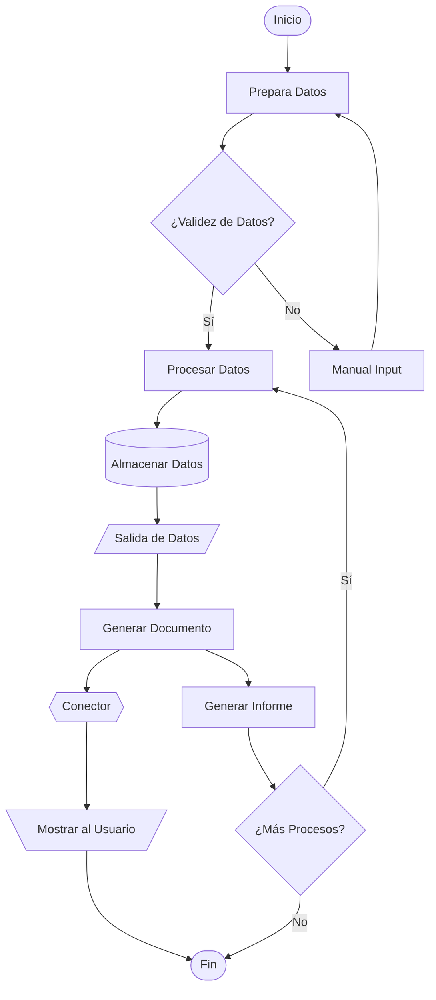

### Paso 1: Preparación del Entorno

Asegúrate de tener acceso a un entorno que pueda renderizar código Mermaid. Esto puede ser un editor de texto con soporte de Mermaid, una herramienta en línea como Mermaid Live Editor, o una página de Markdown que lo soporte.

### Paso 2: Definición de Símbolos en Mermaid

Aquí hay un conjunto más completo de símbolos de diagrama de flujo que se pueden usar en Mermaid:

1. **Inicio/Fin (Start/End)**: Se representa comúnmente por un óvalo o un círculo.
2. **Proceso (Process)**: Usualmente representado por un rectángulo.
3. **Decisión (Decision)**: Representado por un rombo.
4. **Entrada/Salida (Input/Output)**: Representado por un paralelogramo.
5. **Subproceso (Subroutine)**: A menudo ilustrado con un rectángulo con líneas dobles a cada lado.
6. **Documento (Document)**: Un rectángulo con una onda en su parte inferior.
7. **Entrada Manual (Manual Input)**: Un rectángulo inclinado.
8. **Archivo de Datos (Data Storage)**: Un cilindro.
9. **Conector Fuera de Página (Off-page Connector)**: Se puede representar con un escudo.
10. **Conector (Connector)**: Normalmente representado por un pequeño círculo.
11. **Preparación (Preparation)**: Generalmente se ilustra con un hexágono.

### Paso 3: Ejemplo de Diagrama de Flujo Completo

Ahora, vamos a ponerlo todo junto en un diagrama de flujo más complejo:

### Explicación del Ejemplo:

1. **A ([Inicio])**: Indica el inicio del proceso.
2. **B [Prepara Datos]**: Un paso de proceso regular donde se preparan los datos.
3. **C {¿Validez de Datos?}**: Un punto de decisión sobre la validez de los datos.
   - **Sí**: Cuando los datos son válidos, pasa al procesamiento.
   - **No**: Solicita una entrada manual para corregir datos.
4. **E [Manual Input]**: Alerta del ingreso manual de datos incorrectos.
5. **D [Procesar Datos]**: Donde se realiza el procesamiento de datos apropiados.
6. **F [(Almacenar Datos)]**: Simboliza el almacenamiento de datos en un sistema.
7. **G [/Salida de Datos/]**: Lugar donde se introducen los datos salientes.
8. **H [Generar Documento]**: Generación de un documento a partir de los datos procesados.
9. **I {{Conector}}**: Utilizado para conectar diferentes partes del diagrama que pueden no estar directamente unidas.
10. **J [\Mostrar al Usuario/]**: La salida es revisada por el usuario.
11. **K ([Fin])**: Indica el final del proceso.
12. **L [Generar Informe]**: Un sub-proceso opcional para creación de informes.
13. **M {¿Más Procesos?}**: Decide si el flujo debe continuar con procesamiento adicional.

